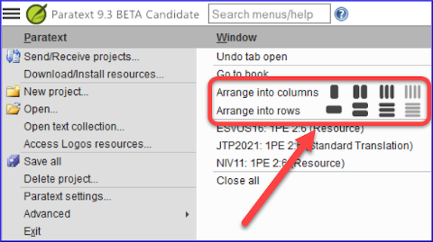

### Paratext Live

Paratext Live uses a couple of servers.

-   Paratext 8, 9.0, 9.1 (and 9.3) use a server called Internet (secondary) WCF 
-   Paratext 9.2 (and 9.3) use Internet (primary) AMQP.  

:::tip
This is why you can't use Paratext Live with 9.2 and 9.1 at the same time.
:::
-   In Paratext 9.3 when you start Paratext live you choose what server you want to use.
    -   **Internet (primary)**, which is 9.2 and 9.3.
    -   **Internet (secondary)** which is 9.0, 9.1 or Paratext 8.

:::note
Everyone in a particular live session still needs to use the same server, it is just that from 9.3 you can work with someone on 9.1 or someone else on 9.2 (just not at the same time) 
:::

### Study Bible Additions

The most obvious new feature the ability to **compare versions**.

1.   Open a Study Bible Additions project
1.   From the **Project** menu,
1.   Under **Project**, choose **Compare Versions**
     - *The changes in the additions are displayed*.

### Scripture reference in navigation bar

In Paratext 9.3 you can copy and paste a scripture reference into the navigation bar.

1.  Copy the text of a reference (from another file)
1.  Click in the **book name** in the navigation bar
1.  Paste using **Ctrl+V**  
      
    -  The reference should be in a format that matches the interface language. For example,
      -   in English: MAT 12.3, Mrk 5:4, Galatians 1:12
      -   in Spanish: Romanos 8:28

:::note
The names must matches the names as they are seen in the titles.  
:::

### Parallel Passages Tool

-   The colours have changed from **green** to **grey**
-   You can reduce or expand the Greek / Hebrew by clicking the little arrow.  
    

### Open text collection

There is a new menu item on the **main menu** 

1.  From the **Paratext ≡ menu**
1.  Choose **Open text collection**  
     -  *This window looks like what was used in earlier versions of Paratext*.
1.  Open a previously **saved text collection** from the bottom left
1.  You can still open a text collection from the **Open** window as well.

### Arranging windows

1.  Arrange windows by **rows** as well as by **columns**.  

:::tip 
Remember to save your layout! 
:::

### Floating Windows

-   Dropdown to change the active project  
    

### Other new/changed

-   **RegEx Pal** - from Main menu \> Advanced or Project menu \> Advanced.
-   **Synchronizing** with Logos and other compatible programs is now turned **on by default**
-   Changes have been made to help with the localization of the help files and the user interface
-   **Bible modules** can now handle **chapter markers** in the extra books
