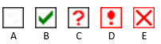

**Introduction**  
In preparing for a consultant check, the consultant will need one or more versions of your text in a language they understand. This is often called a back-translation. There are two types of back translations. This module explains how to do a free back-translation and keep it up to date. The next module explains how to do a word-for-word back-translation using the project interlinearizer.

**Before you start**  
You have typed, checked and revised your translation in Paratext and are now preparing for a consultant check. Before you can start your Administrator must have created a separate project for your back translation.

**Why is this important?**  
Your text needs to be checked by a consultant. But because the consultant does not know your language, you need to translate your text back into a language they can understand. This is where the term “back translation” comes from. The consult will use this translation to help your team improve your exegetical choices in the text.

It is preferable that this is done by someone who hasn’t been involved in your translation. This way she will type what the text says and not what you meant it to say. This should also be done without looking at any helps or other Bibles.

**What will you do?**  
-  Open your project and back translation project
-  Arrange your text on the screen.
-  Draft your back translation
-  Mark the status as finished when you complete a chapter.
-  Check that your text is up-to-date (or in sync), view any differences by moving to the next change if appropriate.

## 16.1 Create a new project for the back translation
 
:::caution
The project is created once by an Administrator. If a project exists see [16.2](#162) below.   
:::
- **≡ Paratext** under **Paratext** \> **New Project** 

### Enter the names for the project
1.  Click **Edit** 
1.  Type a full name for the project and a short name 
1.  Click **OK** 

### Choose the settings of the project
1.  Choose the language for your back translation (e.g. English)
1. Leave the versification
1. For the Type of project choose **Back Translation**
1. For **Based on** choose your project  
   - *If necessary, Paratext will change the versification to match your project.*
1. Click **OK**
   - *The new project opens with links to Create book(s) or Import book(s)*.
:::info
This project does not need to be registered, as it inherits the registration from your project.
:::

### Create books 
1.  Click the **Create Book(s)** link
1.  Create books as needed.  

:::tip
Use the option **Create based on** [your project] so that all of the markers are added to match your project.
:::

## 16.2 Draft your back translation {#162}
1.  Open your project
1.  Open your back translation project
1.  Arrange the windows so that you can easily see both windows.
1.  Click in the back translation window, (the verse in your project is highlighted).
1.  Type your back translation into each verse (after the checkbox).
1.  Continue for each verse in the chapter.
 

## 16.3 Mark the chapter as Finished
When you have finished the chapter

1.  On the toolbar at the top of your back translation window, click on the arrow beside the check mark.  
    
1.  Choose **Mark All Verses in Chapter as Finished**.
    - *All the checkboxes for the chapter are marked with green checks.*

## 16.4 When a change is made to your project
Paratext will detect any saved changes to your text and will change the back translation checkbox to a red question mark  and add issues to the back translation status in Assignments and Progress.

1.  Click in a verse with the red question mark.
1.  Review and correct the back translation.
    - If the changes are not clear, see the “View the differences for outdate verses” below.
1.  When it is correct, click the red question mark  
    - *It changes to a green check mark*

### View the differences for outdated verses
1.  Click on the  icon on the toolbar to see the differences.  
    - *A comparison window is displayed*.  
    

### Move to the next differences
1.  Click on the up and down arrows to move to the previous or next differences.  
    

## 16.5 Check your Assignments and Progress
1.  Click Assignments and Progress icon 
1.  Expand Stage 3, the back translation checks are at the end  
    - *The number of unapproved or changed verses (if any) are listed as issues*  
    

## 16.6 Back translation verse check in Assignments and Progress
1.  Click on the issues link  
    - *A result list window lists any errors.*  
    -  *And the back translation window is also displayed with the cursor in the first verse with problems.*
1.  Correct the problem and move to the next outdated verse by clicking on the arrows on the toolbar.

## 16.7 Back translation status complete in Assignments and Progress
-  The back translation status is complete when there are no issues.

## 16.8 Learning task
The checkboxes in a back translation can have a number of different symbols.

Look in the Paratext help *“What symbols can occur in status checkboxes in a back translation?”* topic and match the following symbols and status:

|  |    |
|---|---------------------------|
| 1 | Inconsistent verse number |
| 2 | No text/verse no.         |
| 3 | Not finished              |
| 4 | Finished                  |
| 5 | Out of date               |

:::info
[Answers: A3, B4, C5, D1, E2]
:::