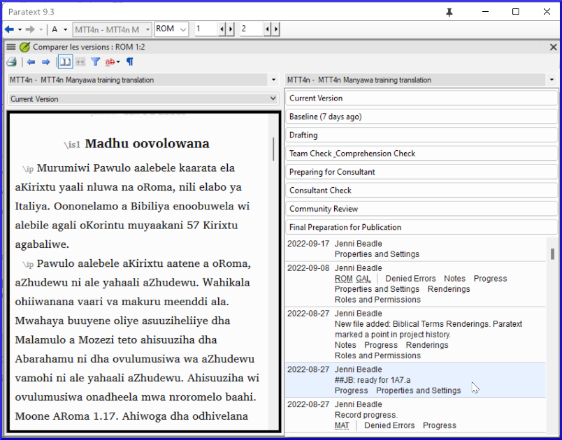

**Introduction**  
In this module, you will learn how to save your text at various points and review them later.

**Before you start**  
You have worked on your text and you have arrived at an important stage of your project.

**Why is this important?**  
As you work on your translation, you will be continually making changes. It is good to have a copy of your text as it was at a particular point, for example as it was before you went to a consultant check. 

**What will you do?**  
You will mark a point in the history of the project. Later you can compare the text at different points.

## 18.1 Mark Point in History
1.  Click in your project window to make it active (in Paratext).
1.  **≡ Tab** under **Project** \> **Mark a point in project history**
1.  Type a comment to describe the point.
2.  Click **OK** 
      -  *The point is added to the project history list*.
  
:::tip
It is good to start the comment with some symbols, like **\#\#**, to easily identify the points you have added in the long list of automatic points that Paratext creates.
:::
## 18.2 Compare Two Versions
Paratext compares the two versions and marks any text that has been deleted or added. 

:::tip
The default display style is to mark any text that has been **deleted** in **red**.  And any text that has been **added** in **green**.  
There are two other style choices Underline/Strikethrough or Underline/Superscript). 
:::
1.  **≡ Tab** expand the menus then under **Project** \> **Compare Versions**
2.  Click on the base version dropdown list  
      
     -  *A list of versions is displayed*.  
      
3.  Choose the desired point in the history  
    -  *The screen shows the differences*.  
    

