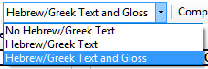
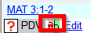

**Introduction**  
There are thousands of passages in the NT where either the same event is being described or where another verse is being quoted from the Old or New Testament. These verses need to be compared to make sure they are consistent.

**Before you start**  
Normally you will have translated and checked the text of both books with a consultant first before comparing the texts. Though there are times that you will want to compare the other verses before you translate the second passage.

**Why is this important?**  
The parallel passages need to be consistent but they do not always need to be exactly the same. The Parallel Passages tool displays the various passages and highlights the text which is the same. But it is the meaning (not necessarily the form) that is important.

Normally you would make the comparisons after you have translated the passage because you don’t want to be influenced by what could be a bad earlier translation. But there are times when you will want to be able to see a second passage while you are translating.

**What you are going to do**  
-  use the Parallel Passages tool to compare the verses.
-  use the check boxes to tell Paratext that you have checked the passages
-  filter for any changed verses
-  open a quick reference window in Paratext to see another passage while you are translating.
-  open a third passage in a window.

## 23.1 Open the Parallel passages window
1.  Navigate to the desired chapter and verse.
1.  **≡ Tab**, under **Tools** \> **Parallel passages**  
    -  *A window is displayed showing a list and parallel passages*.

## 23.2 Display source texts
1.  Click the dropdown arrow beside the source text options  
    
1.  Choose as appropriate  
    -  *The display changes.*
 
> In Paratext 9.3 you can reduce or expand the Greek / Hebrew by clicking the little arrow.  
  

## 23.3 Select comparative texts
1.  Click the **Comparative texts** button
1.  Click a resource (on the left)
1.  Click the right arrow
1.  Repeat as necessary
1.  Click **OK**

## 23.4 Filters
-  Choose the filters as desired: [e.g. All references, Current book, Synoptic gospels]

## 23.5 Compare the passages
-  Click on a line of references in the top pane.  
    -  *The texts are displayed in the bottom pane.*

:::info
- Text is shown in **grey** in a project (or **green** in source texts) when the text is exactly the same as in the other passage.
- Text is shown in **yellow** (in source texts) when it has the same meaning (or thought) even though it is not exactly the same as in the other passage.
- For many people the grey is very hard to see. You can make this darker by going to the main Paratext Settings and changing the highlight to **Bright**. This will also affect highlights in the text and menus
:::

:::tip
If the text is **green** in Greek, then **your text** should also be the same (but **grey**).  
Normally, if the text is different in the Greek than it should be different in your text, but not always.
:::

## 23.6 To correct the text
1.  Click the blue link **Edit**
1.  Make the corrections.
1.  Click **OK**.

## 23.7 Copying a text
:::tip
If two passage need to be the same, you should choose one (normally your later translation) and copy it over the other.
:::
### Copy
1.  Click the blue link **Edit**
1.  Select the text
1.  Copy (Ctrl+C)
1.  Click **OK**.

### Paste
1.  Click blue link for the other text
1.  Select the text
1.  Paste (Ctrl+V)
1.  Click **OK**.

:::caution
Be careful when there is more than one verse. You don’t want to paste the \\v.
:::

## 23.8 Mark the passage as checked
-  Click the check box beside the reference.  
     -  *The set of references are approved*.
     
### Three modes for approving
In this version of Paratext there are three modes for approving.
1.  Open the **menu** for the window.
2.  Under **View** you can choose between
     -  **Approve Sets of Parallels** - which is the default
     -  **Approve Passages individually** individual check boxes
     -  **Approve by Set or Individually** - which allows you to switch back and forth between modes.

### To change from set to individually
1.  Open the menu for the window.
1.  Under View, choose Approve by Set or Individually.  
    -  *Initially, a checkbox for the entire set is shown in the Status column*.
1.  Hover the mouse over the lower checkbox for the set  
    -  *A pencil icon is shown*.
1.  Click the **pencil**
    -  *The checkboxes move to the other mode but only for this set of passages.*

## 23.9 Passages which have changed
Identify the passages which have been changed since they were marked as finished

1.  In the Parallel passage tool
1.  Change the passage filter to **Changed Text**
1.  Click **ab** icon under the passage reference.  
      
    - *A comparison window is displayed in Paratext*.
1.  Change the text as necessary.
1.  Return to the Parallel passages tool (using the task bar icons)
1.  Click the check box to mark it as finished.

## 23.10 Compare the text as you translate
1.  Click in your project.
1.  **≡ Tab**, under **Tools** \> **Quick reference** (Ctrl+q)  
    - *A floating window opens with the scroll group set to none.*  
1.  Change the reference to the other passage.

## 23.11 To see a third passage
1.  Open you project a second time [**≡ Paratext** \> **Paratext** \> **Open** and double-click your project]
1.  Change the scroll group from **[A]** to **None**.  
    
1.  Change the reference to the other passage.