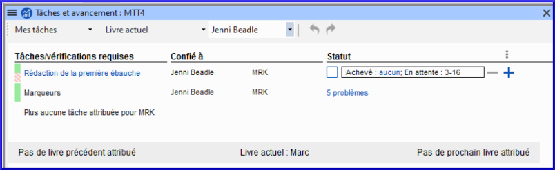
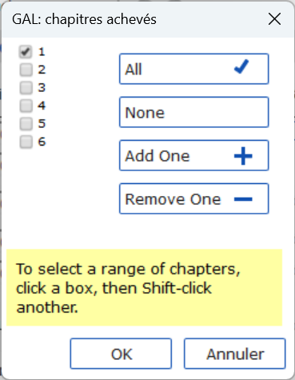

**Introduction**  
On utilise le plan du projet pour nous aider à organiser notre travail et pour voir les taches à faire prochainement. Dès qu’on a fini une tâche, on la note comme fini pour qu’il soit dans le rapport des tâches accomplies. [Si vous avez utilisé une version précédente, vous allez voir que c’est bien amélioré en Paratext 9.] 

**Où en sommes-nous dans le processus ?**  
Les informations relatives aux Tâches et avancement proviennent du plan du projet. Il doit avoir été ajouté et configuré au préalable. [L'administrateur du projet ajoutera le plan d'organisation approprié et le configurera pour votre équipe]

**Pourquoi cette aptitude est-elle importante ?**  
Il y a beaucoup de taches à faire dans un projet de traduction. C’est important d’avoir un système pour nous assurer que tous ont été faits. Puisque votre plan a été configuré, vous pouvez utiliser le plan pour voir quelles tâches ont été affectées (confiées) à vous. Lorsque vous avez terminé la tâche, vous pouvez marquer la tâche comme achevée et voir la tâche suivante à faire. Vous pouvez utiliser cette information pour générer les rapports pour les administrateurs et bailleurs de fonds. (Voir [PP2: Progress de projet](6.PP2.md).)

**Qu’est-ce qu’on va faire ?**  
Vous marquerez une variété de tâches comme achevées. Les étapes exactes varieront légèrement, selon si la tâche est fixée à une fois par projet, une fois par livre, ou par le chapitre. L'endroit pour marquer le progrès pour tous les types de tâches est la colonne Status (Statut).

## 3.1 Afficher les taches à faire

1.  Dans votre projet, cliquez sur le bouton **Tâches et avancement**    
   OU
1.  De la première liste déroulante, choisissez **Mes tâches** ou **Toutes les tâches**  
      
   
     -  *Une liste des différentes tâches et vérifications s'affiche.*

:::tip
Vous pouvez voir plus de détails sur n'importe quelle tâche en cliquant sur le nom de la tâche.
:::

## 3.2 Identifier la prochaine tâche à faire

La liste des tâches vous montre les taches inachevées, chacune avec une barre de couleur à côté.

1.  Identifiez la prochaine tâche à faire. Il aura une barre verte ou verte barrée.
1.  Vérifiez qu’il n'est pas en train d'attendre une autre tâche. Dans ce cas, il y aura une barre rouge.
1.  (Voir les autres modules si nécessaire.)

:::tip
Si vous n'êtes pas en mesure de terminer une vérification, il est possible de reporter la vérification à l'étape suivante.  
Une vérification est achevée quand il indique **Aucun problème**.
:::

## 3.3 Marquer une tâche comme achevée

### Marquer une tâche de livre comme achevée

1.  Cliquez sur la coche à gauche de Statut.  
   
     -   *Il doit devenir solide pour indiquer qu'il est achevé.*

### Marquer une tâche de chapitre comme terminée

1.  Cliquez sur **+** pour marquer le prochain chapitre comme terminé  
      
   
1.  Cliquez à droite sur le mot **Achevé**   
     
     -  *Une boîte de dialogue s’affiche.*  
       
2.  Cochez les chapitres qui ont été achevés.

## 3.4 Vérifications

-   Si la tâche est une vérification, l’état de la vérification indiquera soit le **Paramétrage requis**, soit le nombre de **problèmes** restants.
-   Une vérification est achevée quand il indique **Aucun problème**.

### Vérifications – paramétrage requis (Administrateur)

1.  Click the blue link "Setup required"
     -  *Paratext 9 va soit lancer l’inventaire soit afficher les paramètres appropriés.*
1.  Complétez le paramétrage comme nécessaire.
1.  Fermez la fenêtre quand c'est fini.

:::tip
Si plusieurs inventaires sont nécessaires pour une vérification (par exemple, capitalisation), vous devrez les définir manuellement à partir du menu Outils.
:::

### Vérifications – problèmes

1.  Cliquez sur le lien bleu **problèmes**
     -  *Une liste de problèmes s’affiche.*
1.  Faites les corrections.
1.  Fermez la liste de résultats.
1.  **≡ Paratext** sous **Paratext** \> **Enregistrer tout.** (ou **Ctrl**+**s**).
2.  Retourner aux Tâches et avancement.

:::tip

Une vérification est achevée quand il indique **Aucun problème**. :::tip  
Quand les tâches sont finies, voir les instructions ci-dessous pour apprendre comment les marquer comme achevées.
:::

### Reporter la vérification

1.  **≡ Onglet**, sous **Projet**, sélectionnez **Tâches et Avancement**
1.  Change à **Toutes les tâches**
1.  Passez au-dessus d'un contrôle qui a des problèmes
1.  Cliquez sur **Reporter** (qui apparaît à droite de la colonne Statut)
1.  Choisissez l'étape à laquelle vous souhaitez reporter la vérification.
1.  Tapez la raison pour reporter la vérification
     -  *La vérification s'affiche à cette étape.*
